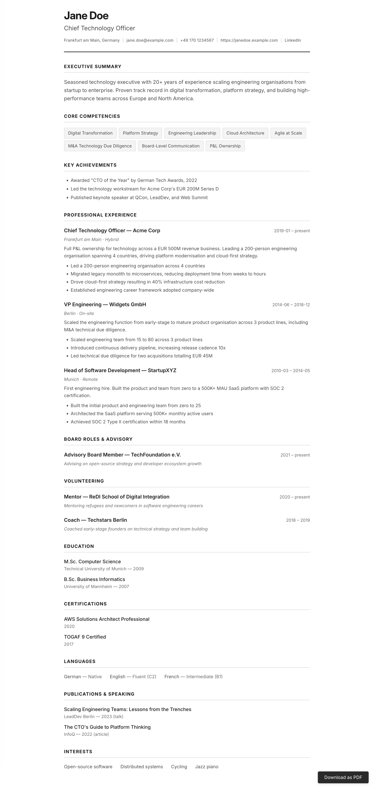

# Online CV

A static CV generator. Write your resume in YAML, get a self-contained HTML page with clean print-to-PDF output.

Built with Node.js + Handlebars. No frameworks, no client-side JavaScript (except the print button).



## Quick start

```bash
npm install
npm run build        # builds dist/index.html from resume.example.yaml
npm run dev          # watch mode with local server at localhost:3000
```

## Custom resume data

```bash
# build with your own YAML
node build.js path/to/your-resume.yaml

# watch mode with custom YAML
node build.js path/to/your-resume.yaml --watch
```

## PDF export

Open the page and click "Download as PDF", or press Cmd/Ctrl+P. The print stylesheet is optimized for A4 with proper page breaks.

## Resume format

Data follows JSON Resume schema in YAML, extended with C-level sections. All sections are optional — omit a key and the section won't render.

```yaml
basics:
  name: Jane Doe
  title: Chief Technology Officer
  email: jane@example.com
  phone: "+49 170 1234567"
  location: Frankfurt am Main, Germany
  url: https://example.com
  linkedin: https://linkedin.com/in/janedoe
  summary: >
    Your executive summary here.

competencies:
  - Digital Transformation
  - Platform Strategy

achievements:
  - Led technology workstream for EUR 200M Series D

experience:
  - role: CTO
    company: Acme Corp
    location: Frankfurt am Main
    workmode: Hybrid          # Hybrid | Remote | On-site
    start: "2019-01"
    end: present
    summary: >
      Brief role description.
    highlights:
      - Achievement with numbers

boardRoles:
  - role: Advisory Board Member
    organisation: TechFoundation e.V.
    start: "2021"
    end: present
    description: What you advise on

volunteering:
  - role: Mentor
    organisation: ReDI School
    start: "2020"
    end: present
    description: What you do

education:
  - institution: Technical University of Munich
    degree: M.Sc. Computer Science
    year: "2009"

certifications:
  - name: AWS Solutions Architect Professional
    year: "2020"

languages:
  - language: German
    level: Native

publications:
  - title: "Talk Title"
    venue: Conference Name
    year: "2023"
    type: talk              # talk | article | book

interests:
  - Open-source software
  - Cycling
```

## Section order

1. Header (name, title, contact)
2. Executive Summary
3. Core Competencies (tag layout)
4. Key Achievements
5. Professional Experience
6. Board Roles & Advisory
7. Volunteering
8. Education
9. Certifications
10. Languages
11. Publications & Speaking
12. Interests

## Validation

The build validates your YAML and will:
- **Error** on missing required fields: `basics.name`, `basics.title`
- **Warn** on missing recommended fields: `basics.summary`, `competencies`, `experience`

## Stack

- Node.js + Handlebars for templating
- js-yaml for YAML parsing
- Inter (Google Fonts) for typography
- Zero client-side dependencies
